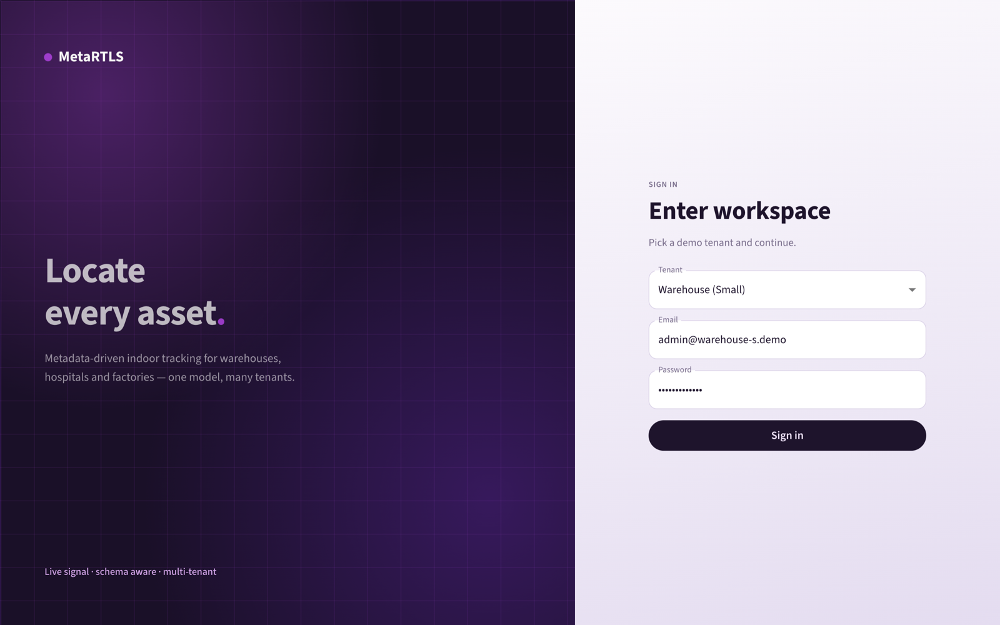
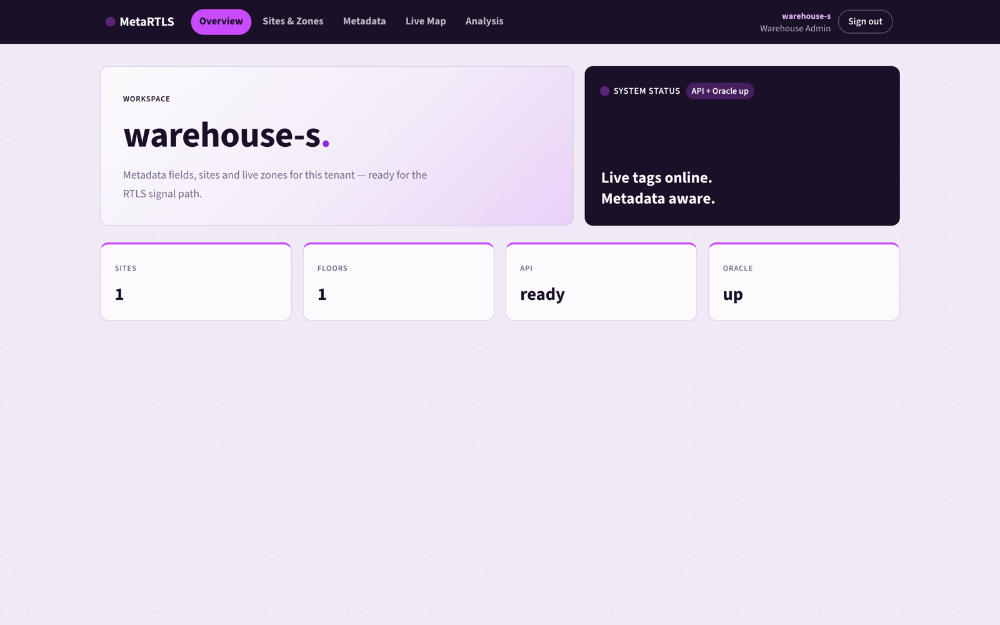
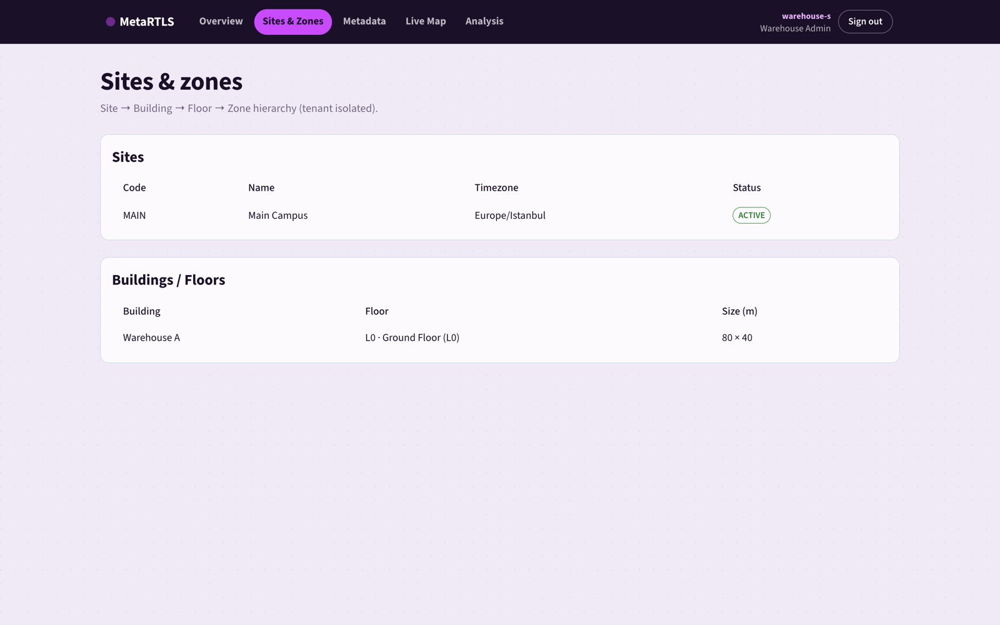
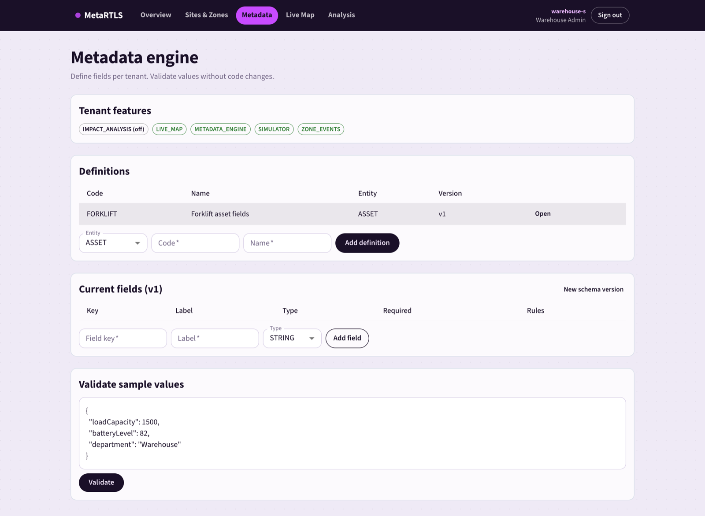
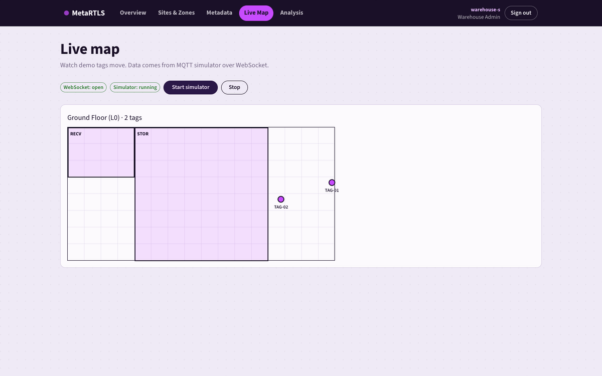
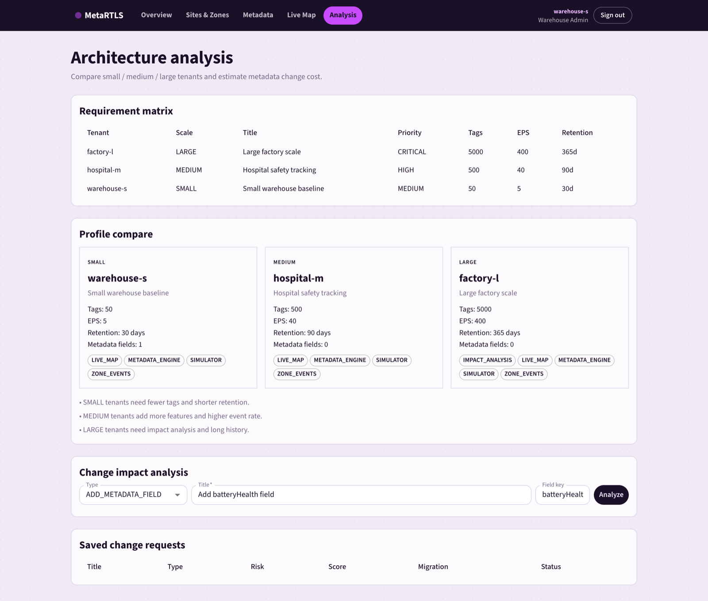

# MetaRTLS

MetaRTLS is a multi-tenant indoor location app.
It uses Go, React and Oracle.
You do not need real devices. The app can simulate moving tags.

## What you need

\- Docker Desktop
\- Go 1.24+
\- Node.js 22+

## How to start the whole project

Open a terminal in the project root folder.
Then run these steps in order.

### 1) Create your config file

```bash
cp config/config-temp.env config/config.env
```

`config-temp.env` is the template.
`config.env` is your local file (JSON).

### 2) Start Oracle and MQTT

```bash
make up
```

This starts:
\- Oracle database on port `1521`
\- Mosquitto MQTT on port `1883`

Wait 1–3 minutes the first time until Oracle is ready.

### 3) Install dependencies

```bash
make deps
```

### 4) Start the backend API

Open one terminal:

```bash
make backend-run
```

API URL: http://localhost:8090

Check:
\- http://localhost:8090/health
\- http://localhost:8090/ready
\- http://localhost:8090?func=getversion
\- http://localhost:8090?func=getconfig

`/ready` must say Oracle is up.

Frontend version/config:
\- http://localhost:5173?func=getversion
\- http://localhost:5173?func=getconfig

### 5) Start the frontend UI

Open another terminal:

```bash
make frontend-run
```

UI URL: http://localhost:5173

Open this URL in your browser.

### Demo login

| Tenant | Email | Password |
|--------|-------|----------|
| warehouse-s | admin@warehouse-s.demo | MetaRTLS!2026 |
| hospital-m | admin@hospital-m.demo | MetaRTLS!2026 |
| factory-l | admin@factory-l.demo | MetaRTLS!2026 |

## Useful commands

```bash
make ready   # check API + Oracle
make test    # run backend tests
make down    # stop Docker services
make logs    # show Docker logs
```

## Screenshots

### Login



### Overview



### Sites & Zones



### Metadata



### Live Map

Moving tags on the floor plan (MQTT simulator + WebSocket):



### Analysis



## Stack

| Part | Tech |
|------|------|
| Backend | Go, Gin, go-ora |
| Frontend | React, TypeScript, Vite, MUI |
| Database | Oracle 23ai Free |
| Messaging | MQTT (Mosquitto) |
| Auth | JWT |
| Live updates | WebSocket |
| Local run | Docker Compose, Makefile |
| CI | GitHub Actions |

## What it does

\- Tenant login
\- Sites, floors and zones
\- Metadata fields and validation
\- MQTT tag simulator
\- Live map with WebSocket
\- Compare small / medium / large tenants
\- Simple change impact score
\- Health and ready checks

## More docs

\- Backend: `backend/README.md`
\- Frontend: `frontend/README.md`

## Production notes

\- Edit `config/config.env`
\- Set `appEnv` to `production`
\- Use a long random `jwtSecret` (32+ characters)
\- Set `corsOrigins` to your real UI URL
\- Do not commit real secrets

## Folders

\- `backend/` — Go API
\- `frontend/` — React UI
\- `config/` — JSON config
\- `docs/images/` — screenshots
\- `logs/` — log files
\- `deploy/` — Mosquitto config
\- `.github/workflows/` — CI

## License

Private / educational portfolio project.
